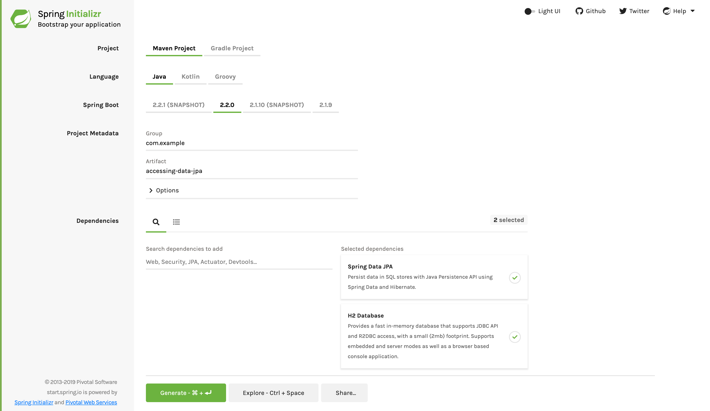

:toc:
:tabsize: 4
:icons: font
:source-highlighter: prettify
:project_id: gs-accessing-data-jpa

This guide walks you through the process of building an application that uses Spring Data JPA to store and retrieve data in a relational database.

== What You Will build

You will build an application that stores `Customer` POJOs (Plain Old Java Objects) in a memory-based database.

== What You need

:java_version: 1.8
include::https://raw.githubusercontent.com/spring-guides/getting-started-macros/master/prereq_editor_jdk_buildtools.adoc[]

include::https://raw.githubusercontent.com/spring-guides/getting-started-macros/master/how_to_complete_this_guide.adoc[]

[[scratch]]
== Starting with Spring Initializr

For all Spring applications, you should start with the https://start.spring.io[Spring
Initializr]. The Initializr offers a fast way to pull in all the dependencies you need for
an application and does a lot of the set up for you. This example needs the JPA and H2
dependencies. The following image shows the Initializr set up for this sample project:

NOTE: The preceding image shows the Initializr with Maven chosen as the build tool. You
can also use Gradle. It also shows values of `com.example` and `accessing-data-jpa` as the
Group and Artifact, respectively. You will use those values throughout the rest of this sample.

The following listing shows the `pom.xml` file created when you choose Maven:

====
[src,xml]
----
include::complete/pom.xml[]
----
====

The following listing shows the `build.gradle` file created when you choose Gradle:

====
[src,gradle]
----
include::complete/build.gradle[]
----
====

[[initial]]
== Define a Simple Entity

In this example, you store `Customer` objects, each annotated as a JPA entity. The
following listing shows the Customer class (in
	`src/main/java/com/example/accessingdatajpa/Customer.java`):

====
[source,java,tabsize=2,indent=0]
----
include::complete/src/main/java/com/example/accessingdatajpa/Customer.java[]
----
====

Here you have a `Customer` class with three attributes: `id`, `firstName`, and `lastName`.
You also have two constructors. The default constructor exists only for the sake of JPA.
You do not use it directly, so it is designated as `protected`. The other constructor is
the one you use to create instances of `Customer` to be saved to the database.

The `Customer` class is annotated with `@Entity`, indicating that it is a JPA entity.
(Because no `@Table` annotation exists, it is assumed that this entity is mapped to a
	table named `Customer`.)

The `Customer` object's `id` property is annotated with `@Id` so that JPA recognizes it as
the object's ID. The `id` property is also annotated with `@GeneratedValue` to indicate
that the ID should be generated automatically.

The other two properties, `firstName` and `lastName`, are left unannotated. It is assumed
that they are mapped to columns that share the same names as the properties themselves.

The convenient `toString()` method print outs the customer's properties.

== Create Simple Queries

Spring Data JPA focuses on using JPA to store data in a relational database. Its most
compelling feature is the ability to create repository implementations automatically, at
runtime, from a repository interface.

To see how this works, create a repository interface that works with `Customer` entities
as the following listing (in `src/main/java/com/example/accessingdatajpa/CustomerRepository.java`) shows:

====
[source,java,tabsize=2]
----
include::complete/src/main/java/com/example/accessingdatajpa/CustomerRepository.java[]
----
====

`CustomerRepository` extends the `CrudRepository` interface. The type of entity and ID
that it works with, `Customer` and `Long`, are specified in the generic parameters on
`CrudRepository`. By extending `CrudRepository`, `CustomerRepository` inherits several
methods for working with `Customer` persistence, including methods for saving, deleting,
and finding `Customer` entities.

Spring Data JPA also lets you define other query methods by declaring their method
signature. For example, `CustomerRepository` includes the `findByLastName()` method.

In a typical Java application, you might expect to write a class that implements
`CustomerRepository`. However, that is what makes Spring Data JPA so powerful: You need
not write an implementation of the repository interface. Spring Data JPA creates an
implementation when you run the application.

Now you can wire up this example and see what it looks like!

== Create an Application Class

Spring Initializr creates a simple class for the application. The following listing shows
the class that Initializr created for this example (in
`src/main/java/com/example/accessingdatajpa/AccessingDataJpaApplication.java`):

====
[source,java,tabsize=2]
----
include::initial/src/main/java/com/example/accessingdatajpa/AccessingDataJpaApplication.java[]
----
====

include::https://raw.githubusercontent.com/spring-guides/getting-started-macros/master/spring-boot-application-new-path.adoc[]

Now you need to modify the simple class that the Initializr created for you. To get output
(to the console, in this example), you need to set up a logger. Then you need to set up
some data and use it to generate output. The following listing shows the finished
`AccessingDataJpaApplication` class (in
`src/main/java/com/example/accessingdatajpa/AccessingDataJpaApplication.java`):

====
[source,java,tabsize=2]
----
include::complete/src/main/java/com/example/accessingdatajpa/AccessingDataJpaApplication.java[]
----
====

`Application` includes a `demo()` method that puts the `CustomerRepository` through a few tests. First, it fetches the `CustomerRepository` from the Spring application context. Then it saves a handful of `Customer` objects, demonstrating the `save()` method and setting up some data to work with. Next, it calls `findAll()` to fetch all `Customer` objects from the database. Then it calls `findOne()` to fetch a single `Customer` by its ID. Finally, it calls `findByLastName()` to find all customers whose last name is "Bauer". The `demo()` method returns a `CommandLineRunner` bean that automatically runs the code when the application launches.

The `AccessingDataJpaApplication` class includes a `main()` method that puts the
`CustomerRepository` through a few tests. First, it fetches the `CustomerRepository` from
the Spring application context. Then it saves a handful of `Customer` objects,
demonstrating the `save()` method and setting up some data to use. Next, it calls
`findAll()` to fetch all `Customer` objects from the database. Then it calls `findOne()`
to fetch a single `Customer` by its ID. Finally, it calls `findByLastName()` to find all
customers whose last name is "Bauer".

NOTE: By default, Spring Boot enables JPA repository support and looks in the package (and
	its subpackages) where `@SpringBootApplication` is located. If your configuration has
	JPA repository interface definitions located in a package that is not visible, you can
	point out alternate packages by using `@EnableJpaRepositories` and its type-safe
	`basePackageClasses=MyRepository.class` parameter.

include::https://raw.githubusercontent.com/spring-guides/getting-started-macros/master/build_an_executable_jar_mainhead.adoc[]

include::https://raw.githubusercontent.com/spring-guides/getting-started-macros/master/build_an_executable_jar_with_both.adoc[]

When you run your application, you should see output similar to the following:

====
----
== Customers found with findAll():
Customer[id=1, firstName='Jack', lastName='Bauer']
Customer[id=2, firstName='Chloe', lastName='O'Brian']
Customer[id=3, firstName='Kim', lastName='Bauer']
Customer[id=4, firstName='David', lastName='Palmer']
Customer[id=5, firstName='Michelle', lastName='Dessler']

== Customer found with findById(1L):
Customer[id=1, firstName='Jack', lastName='Bauer']

== Customer found with findByLastName('Bauer'):
Customer[id=1, firstName='Jack', lastName='Bauer']
Customer[id=3, firstName='Kim', lastName='Bauer']
----
====

== Summary

Congratulations! You have written a simple application that uses Spring Data JPA to save
objects to and fetch them from a database, all without writing a concrete repository
implementation.

NOTE: If you want to expose JPA repositories with a hypermedia-based RESTful front end
with little effort, you might want to read link:/guides/gs/accessing-data-rest[Accessing JPA Data with REST].

== See Also

The following guides may also be helpful:

* https://spring.io/guides/gs/accessing-data-rest[Accessing JPA Data with REST]
* https://spring.io/guides/gs/accessing-data-gemfire/[Accessing Data with Gemfire]
* https://spring.io/guides/gs/accessing-data-mongodb/[Accessing Data with MongoDB]
* https://spring.io/guides/gs/accessing-data-mysql/[Accessing data with MySQL]
* https://spring.io/guides/gs/accessing-data-neo4j/[Accessing Data with Neo4j]

include::https://raw.githubusercontent.com/spring-guides/getting-started-macros/master/footer.adoc[]
